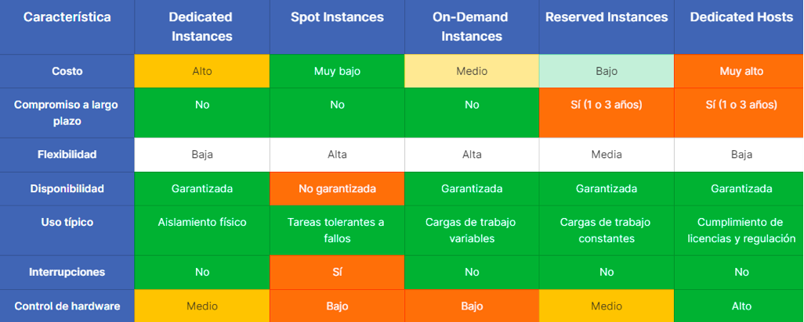

[Computo](../../01-Computo/)

# 1. AWS Elastic Compute Cloud

## 1.1 ¿Que es?

Servicio que ofrece una capacidad informática segura y tamaño variable en la nube

-> Permite escalado vertical para satisfacer recursos
-> Se puede utilizar para ejecutar una BD administrada por el cliente

## Instancias

M.5.2xLarge

    - Estructura basica de una instancias

        * M         : Tipo de instancia
        * 5         : Generación
        * 2xLarge   : Tamanio

# 4 Tipos

## 1- Instancias Bajo Demanda

Se ejecuta solo cuando es necesario, pero permanece activa durante la duración del proceso.
Se paga por la capacidad de computo por hora o por segundo según las instancias que se ejecutan 
no se requiere paso por adelantado ni compromiso a largo plazo
Se recomienda para:

- usuarios que quieran bajo coste y flexibilidad sin compromisos 
- app con caras de trabajo a corto plazo con picos de actividad impredecibles que no se pueden interrumpir

🗒 Tarjeta: Palabras Claves »

| Instancias Bajo Demanda |
| ---- |
| Es ideal para aplicaciones con cargas de trabajo impredecibles o en pruebas y desarrollo. |

 

## 2- Instancias Spot

Permiten aprovechar la capacidad de computo no utilizada a precios reducidos 90%, Sin embargo te la pueden sacar con un tiempo de anticipación no mayor a los 2 min o asi
Se recomienda para:

-> Aplicaciones con horarios flexible (inicio/fin)
-> Aplicaciones que son factibles a precios bajos
-> Usuarios con necesidades informáticas de pruebas y desarrollo.

🗒 Tarjeta: Palabras Claves »

| Instancias SPOT |
| ---- |
| interrumpible - barata  |

 

## 3- Instancias Reservadas

Permiten reservar capacidad de computo por 1 o 3 años con descuento significativo ~ 72% 
Se ofrecen en tres opciones de pago: 
    
- All Upfront (todo por adelantado) `la mas clave`
- Partial Upfront (parcialmente por adelantado) 
- No Upfront (sin pago inicial).

`Reservadas convertibles` son mas caras que las `Estandars`

🗒 Tarjeta: Palabras Claves »

| Instancias Reservadas |
| ---- |
| largo tiempo  |

## 4- Instancias Dedicadas 

Estan fisicamente aisladas en el nivel de host de HW lo que significa que tus instancias 

🗒 Tarjeta: Palabras Claves »

| Instancias Dedicadas |
| ---- |
| Estas son como alquilar un cuarto en un hotel es tuyo y vos ahi haces lo que quieras |

## 4.5- Host Dedicados

Servidor físico completamente dedicado para su uso con control total sobre la colocación de instancias y visibilidad del hardWare subyacente.
Un usuario debe cumplir con los requisitos de licencia de SoftWare y cumplimiento que establecen que una carga de trabajo tiene que alojarse en un servidor físico
Tiene compromiso de 1 o 3 años

 

🗒 Tarjeta: Palabras Claves »

| Host Dedicados |
| ---- |
| fisico - aislada a nivel de nucleo |

 

🗒 Tarjeta: Reflejo »

| Host Dedicados |
| ---- |
| Es como alquilar una casa, todo para vos |

 

🗒 Tarjeta: Modelo de Servicio »

| Pertenece a:  |
| ---- |
| IaaS |

### Tabla

## Placement Group

Este tema trata de las estrategias de colocacion de las EC2 a la hora de enfrentar un proyecto. Hay 3 tipos cada una posee pros y contras

1. Cluster

Agrupar todas las instancias dentro de la misma AZ para lograr una mayor potencia y una baja latencia a contra de que si se cae la az chau.
Su caso de uso se da con aplicaciones de Big Data que requieran mucha potencia

2. Spread

Distinta a la primera poner la distribucion en distintas AZ, soluciona el problema anterior pero hay que tener encuenta que por AZ se pueden tener un maximo de 7 instancias 

Su caso de uso se da en aplicaciones que requieran una alta disponibilidad

3. Particion

Los mejor de los dos mundos, agrupa las instancias en un "Rack" en distintas az o en la misma 

 

> [LightSail](./lightsail.md)

 