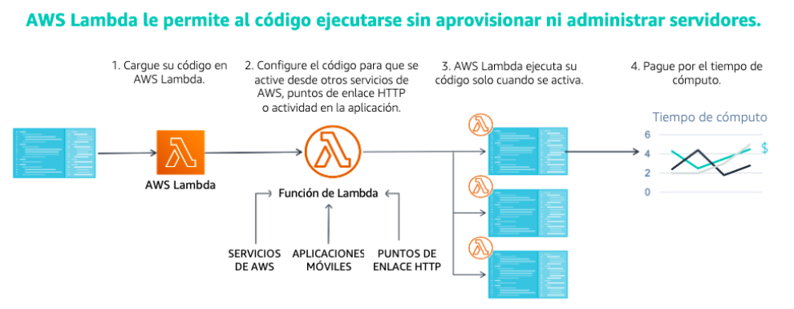

[Computo](../../01-Computo/)

# 1. AWS Lambda

## 1.1 ¿Que es?

Automatizado de procesos mediante codigo en cargas de trabajo basada en eventos.
Caracteristicas:

-> La informática sin servidor le permite crear y ejecutar aplicaciones y servicios sin aprovisionar ni administrar servidores. 
-> Medición en periodos inferiores a un segundo
-> El tiempo de ejecución de una función se limita a un máximo de 15 minutos 
-> Proporciona tolerancia a errores integrada y escalado automático.
-> El máximo de asignación de memoria para una sola función de Lambda es de 3GB
-> Pagas por lo que usas

# Mejores practicas

| Diseño de funciones | Optimizacion de rendimiento | Manejo de errores y Reintentos | Seguridad | Pruebas | Monitoreo y Alertas | Consideraciones Adicionales | Herramientas y recursos |
|:---:|:---:|:---:|:---:|:---:|:---:|:---:|:---:|
| Mantener funciones perqueñas y enfocadas | Utilizar caché | Implementar manejo de Errores Robusto | Utilizar Roles [IAM](../../05-Seguridad_Identidad_y_Cumplimiento/Identidad%20de%20Acceso/IAM.md) | Pruebas unitarias | Utilizar [CloudWatch](../../06-Administracion_y_Gobernanza/CloudWatch.md) | Diseño modular | AWS SAM |
|:---:|:---:|:---:|:---:|:---:|:---:|:---:|:---:|
| Utilizar variables de entorno | Minimizar llamadas a servicios externos | Configurar Reintentos | Encriptar datos | Pruebas de integración | Configurar Alarmas | Utilizar capas de Lambda | AWS Lambda Powertools |
|:---:|:---:|:---:|:---:|:---:|:---:|:---:|:---:|
| Minimizar el tamaño del paquete de despliegue | Optimizar codigo | Utilizar colas de mensajes muertas | Validar entrada | Pruebas de carga | - | Considerar el uso de [Contenedores](../03-Contenedores/) | Documentacion de AWS Lambda |
|:---:|:---:|:---:|:---:|:---:|:---:|:---:|:---:|
| Considerar el tiempo de ejecución | Utilizar concurrencia provisionada | - | Mantener runtimes actualizados | - | - | - | - |

### Funciomamiento

 

## Informacion suelta de algun test

* API Gateway + Lambda is the perfect solution for modern applications with serverless architecture.

 

> [Elastic Container Registry](../03-Contenedores/ECR.md)

 