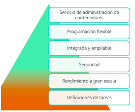

[Computo](../../01-Computo/)

# 1. AWS Elastic Container Service

## 1.1 ¿Que es?

Servicio de orquestación de contenedores completamente administrado que facilita la implementacion, administración y escalado de aplicaciones en contenedores.

## Informacion suelta de algun test

    - Amazon ECS es un servicio de orquestación de contenedores totalmente administrado, pero no es la mejor opción para este escenario porque no es compatible con Kubernetes.

 

    
🗒 Tarjeta: ECR »

    | Info clave  |
    | ---- |
    | Despliegue de contenedores |

 

 

    
🗒 Tarjeta: Contenedores »

    | Definicion  |
    | ---- |
    | Un método de virtualización del SO - Una aplicación y sus dependencias, que se pueden ejecutar en procesos aislados de recursos. |
 

 
    

    
🗒 Tarjeta: Dockers »

    | Definicion  |
    | ---- |
    | Es una plataforma de aplicaciones(SW) que se utiliza para crear, administrar y ejecutar contenedores (básicamente lo empaqueta - Docker permite a los desarrolladores e ingenieros crear, probar, implementar y ejecutar contenedores |

 

 

### Beneficios

 

> [Elastic Kubernetes Service](./EKS.md)

 