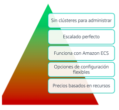

[Computo](../../01-Computo/)

# 1. AWS Fargate

## 1.1 ¿Que es?

Servicio que permite ejecutar Contenedores sin tener que depender de servidores o clusteres

## Informacion suelta de algun test

    - AWS Fargate son servicios informáticos que no proporcionan directamente protección DDoS
    - AWS Fargate es un motor informático sin servidor para contenedores que funciona tanto con ECS como con EKS.
    - AWS Fargate es un motor informático sin servidor para contenedores, y puede escalar automáticamente en respuesta al patrón de tráfico.
    - Amazon ECS con el tipo de lanzamiento Fargate es un motor informático sin servidor para contenedores. Aunque puede ejecutar tareas largas, no gestiona de forma inherente las dependencias de trabajos ni el procesamiento por lotes.
    - 

### Beneficios

 

> [OutPost](../04-EDGE%20HIBRIDO/outpost.md)

 
