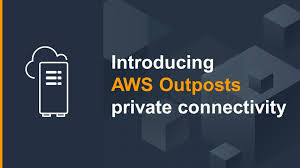

[Computo](../../01-Computo/)

# 1. AWS OutPost

## 1.1 ¿Que es?

Servicio totalmente administrado que extiende la infraestructura (te traen un servidor físico), los servicios, las API y las herramientas de AWS a prácticamente cualquier centro de datos, espacio de comunicación o instalación local para lograr una experiencia híbrida uniforme. 

AWS Outposts es ideal para cargas de trabajo que requieren acceso de baja latencia a sistemas locales, procesamiento de datos locales o almacenamiento de datos locales.

Posee 2 variantes:

    - VMware Cloud on AWS Outpost permite utilizar el mismo plano de control y las mismas API de VMWare que utiliza para ejecutar la infraestructura
    - AWS / la variante nativa de OutPost le permite usar exactamente las mismas API y el mismo plano de control que utiliza para ejecutar en las instalaciones nube pero local.

## Informacion suelta de algun test

    - AWS Outposts amplía la infraestructura y los servicios de AWS a prácticamente cualquier centro de datos, espacio de coubicación o instalación local, pero no proporciona protección DDoS de forma inherente.
    - AWS Outposts is a fully managed service that extends AWS infrastructure, services, APIs, and tools to virtually any datacenter, co-location space, or on-premises facility for a truly consistent hybrid experience.

🗒 Tarjeta: OutPost »

| Definicion  |
| ---- |
| agregar algo |

 

> [WaveLength](./wavelength.md)

 