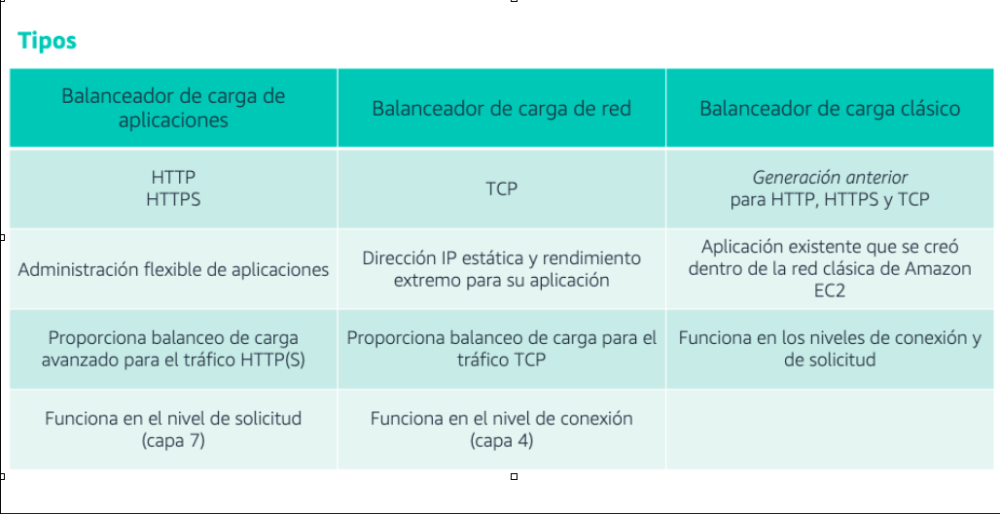

[Computo](../../01-Computo/)

# 1. AWS Elastic Load Balancing

## 1.1 ¿Que es?

Elastic Load Balancing distribuye automáticamente el tráfico entrante entre varios destinos, por ejemplo, instancias EC2, contenedores y direcciones IP en una o varias zonas de disponibilidad. 

Monitorea el estado de los destinos registrados y enruta el tráfico solamente a destinos en buen estado. 

ELB escala de forma automática su capacidad de equilibrador de carga en respuesta a los cambios en el tráfico entrante.

Es administrado por AWS si yo lo quiero administrar sale menos

Características:

* Alta disponibilidad
* Comprobaciones de estado
* Características de seguridad

Por que usar

* Tener un punto de acceso DNS para la aplicacion
* Checkeos de salud de las instancias
* Separa el trafico privado del publico

## 4 Tipos

### 1. Classic Load Balancer (CLB)

* Compatible con HTTP, HTTPS, TCP, SSL o CP de seguridad
**NO USAR ESTA OBSOLETO (pero se puede usar)**

### 2. Aplication Load Balancer (ALB)

* Compatible con HTTP, HTTPS, WebSocket
Funciona en la Capa 7.
Toma decisiones de enrutamiento con base en el contenido.
Por lo general se usa en arquitecturas de microservidores y contenedores.

Permite equilibrar la carga de varias aplicacines en la misma instancia EC2
Puede redirigir HTTP a HTTPS

    - Rutas basadas en URL
    - Rutas basadas en HostName
    - Rutas basadas en encabezados

#### A quien se dirige

* EC2 - HTTP (a traves de [Autoscalling](../01-Maquinas%20Virtuales/autoscalling.md))
* ECS - HTTP (a traves del propio [ECS](../03-Contenedores/ECS.md))
* [Lambda](../02-Sin_Servidor/lambda.md) - HTTP por JSON event
* IP adress

### 3. Network Load Balancer (NLB)

* Compatible con TCP, TLS (secure TCP) y UDP
Opera en la capa 4

### 4. Gateway Load Balancer (GWLB)

* Opera en la capa de Red (OSI) - IP Protocol

🗒 Tarjeta: Modelo de Servicio »

| Tipos  |
| ---- |
|  |

 

> [Saving Plans](./saving_Plans.md)

 