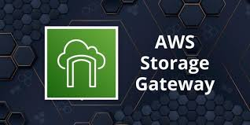
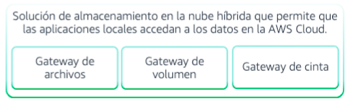
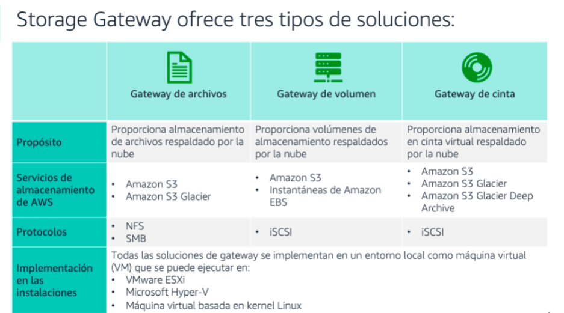

[Almacenamiento](../../02-Almacenamiento/)

# 1. AWS Storage Gateway

## 1.1 ¿Que es?

Es un servicio de almacenamiento híbrido que permite que sus aplicaciones locales utilicen el almacenamiento en la nube de AWS. Las aplicaciones se conectan al servicio mediante una máquina virtual o un dispositivo Gateway de hardware.

Puede utilizar Storage Gateway para copias de seguridad y archivado, recuperación ante desastres (DR), procesamiento de datos en la nube, niveles de almacenamiento y migración.

Storage Gateway utiliza protocolos de almacenamiento estándar: 

    - Sistema de archivos de red (NFS)
    - Bloque de mensajes del servidor (SMB)
    - Interfaz interna de equipo pequeño (iSCSI) 

La Gateway se conecta a los servicios de almacenamiento de AWS:

    - S3 / S3 Glacier / Amazon EBS

Storage Gateway proporciona almacenamiento en AWS para: 

    -Archivos / Volúmenes / Cintas virtuales

## Informacion suelta de algun test

    * While AWS Storage Gateway's File Gateway provides a virtual on-premises file server, which can store and retrieve objects in Amazon S3, it does not inherently provide scheduling to avoid peak hours
    * AWS Storage Gateway is a hybrid storage service that enables on-premises applications to seamlessly use AWS cloud storage.
    

### Tipos de soluciones

 

> [Elastic Block Store](../De%20Bloque,%20en%20Archivos%20y%20Objetos/ebs.md)

 