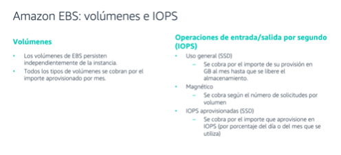
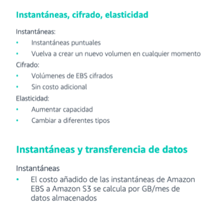

[Almacenamiento](../../02-Almacenamiento/)

# 1. AWS Elastic Block Store

## 1.1 ¿Que es?

Amazon EBS proporciona volúmenes de almacenamiento de bloques persistentes e replican automáticamente dentro de su zona de disponibilidad (AZ).

Cada volumen de EBS se replica automáticamente dentro de su zona de disponibilidad.

Con Amazon EBS, puede aumentar o reducir su uso en cuestión de minutos

Se puede realizar una copia de seguridad automática en Amazon S3.

Con EBS se puede crear y administrar las siguientes recursos de almacenamiento en bloque

    |- Volumenes:    Se conectan a la EC2 y se usan como se usaria un disco local conectado a una pc.
    |                Es responsabilidad del cliente que esten respaldadas.
    |
    |-- Instantaneas: Copias de seguridad de los volumenes

## Informacion suelta de algun test

    * Amazon EBS is block-level storage used with Amazon EC2 instances, which is not suitable for static content
    * Amazon EBS snapshots are a good way to back up point-in-time state of your data but they are not meant for long-term data archiving
    * It does not support lifecycle policies and is not designed for global access.

### Volumenes e Iops

 

### Informacion almacenamiento

 

> [Elastic File Store](./efs.md)

 