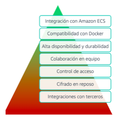

[Computo](../../Computo/)

# 1. AWS Elastic Container Registry

## 1.1 ¿Que es?

Servicio de administracion y registro de imágenes de contenedores administrado por AWS
    - Seguro
    - Escalable
    - Confiable

Es un registro de contenedores Docker completamente administrado que facilita los desarrolladores las tareas de almacenamiento, administración e implementación de imágenes de contenedores Docker.

## Informacion suelta de algun test

    -

🗒 Tarjeta: ECR »

| Info clave  |
| ---- |
| Sin esto no existen contenedores |

### Beneficios 

 

> [Elastic Container Service](./ECS.md)

 