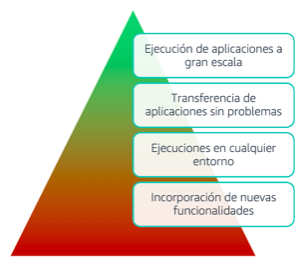
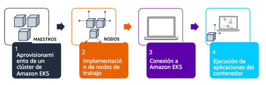

[Computo](../../Computo/)

# 1. AWS Elastic Kubernetes Service

## 1.1 que es

Servicio que permite ejecutar Kubernetes en la nube y centros de datos locales

## Informacion suelta de algun test

    - Amazon EKS es un servicio de Kubernetes totalmente administrado y es la mejor opción para este escenario. Proporciona integración nativa de Kubernetes con los servicios de AWS, lo que facilita a la empresa la migración de su aplicación de Kubernetes existente.

🗒 Tarjeta: Kubenetes »

| Definicion  |
| ---- |
| SoftWare de codigo abierto para el aprovisionamiento y administracion de contenedores |

 

> [Fargate](./Fargate.md)

 