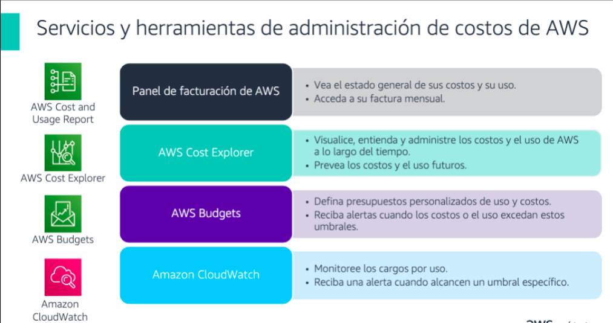
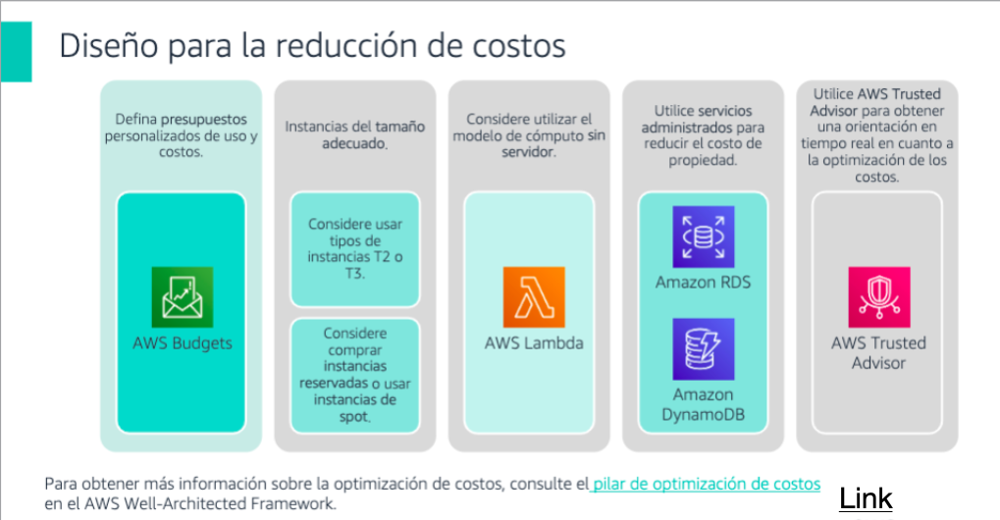

# Costos en la nube

## Gastos del Capital (CAPEX)

    * Los fondos de una empresa para adquirir actualizar y mantener activos fisicos 

        - Propiedades
        - Edificios industriales
        - Equipos

## Gastos Variables

    * Un gasto que la persona que asume el costo puede alterar o evitar

## Servicios 

## Diseño

