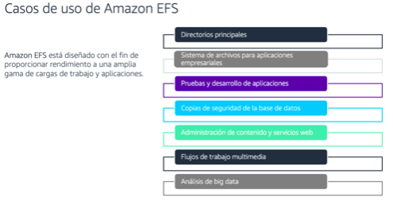

[Almacenamiento](../../2-Almacenamiento/)

# 1. AWS Elastic File System

## 1.1 ¿Que es?

Amacenamiento de sistemas de archivo de red (NFS) elastico escalable totalmente administrado para utilizar con servicios en la nube e hibrido.

Facilita trabajos que requieren acceso de varias instancias de datos compartidos.

Características:

    1. Sistema de archivos de baja latencia a escala de petabytes
    1. Elasticidad
    1. Soporta NFS
    1. Compatible con Amazon Machine Images (AMI) basadas en Linux para EC2

Utilice Amazon EFS para brindar soporte a las cargas de trabajo **basadas en Linux** en AWS o de en las instalaciones que requieren un almacenamiento de sistemas de archivos compartidos.

Beneficios:

    * Elastico:
        - Proporciona almacenamiento de archivos sencillo, escalable y elástico para su uso con los servicios de AWS
    * Elasticidad dinámica:
        - Crece y se reduce automáticamente a medida que agrega y elimina archivos.
    * Gestión completa:
        - Proporciona un almacenamiento compartido del sistema de archivos para cargas de trabajo Linux.

## Informacion suelta de algun test

    * Amazon EFS is a file storage service for use with Amazon EC2 instances, and it may be more expensive and less suitable for static content
    * is not a cost-effective solution for long-term archiving.
    * provides file storage and supports lifecycle management, but it is not optimized for storing large amounts of user-generated content like photos and videos which are typically stored as objects rather than files.
    

### Casos de uso

 

> [File Cache](./file_cache.md)

 