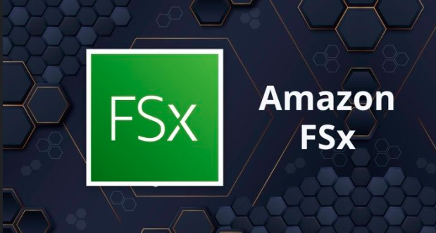

[Almacenamiento](../../2-Almacenamiento/)

# 1. AWS FSX

## 1.1 que es

Facilita y abarata el lanzamiento, la ejecución y la ampliación de sistemas de archivos de alto rendimiento y con numerosas funciones en la nube.

Sirve para distintos so pero hay que usar la versión de ese por lo general **Windows**
Es curioso este servicio ya que tiene distintas adaptaciones for lustre .. for windows entre otras

## Informacion suelta de algun test

    *

 

> [File Cache](./S3.md)

 