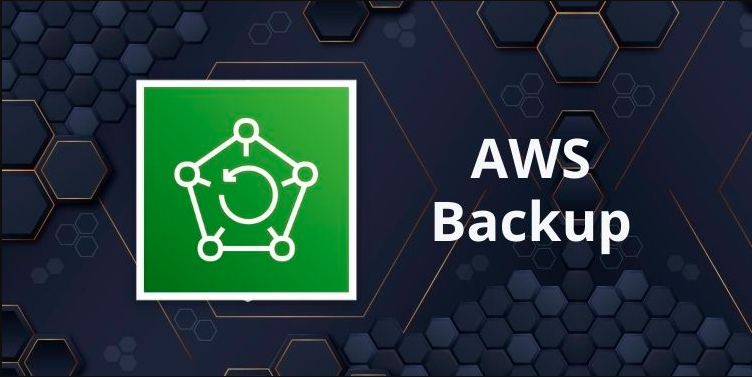

[Almacenamiento](../../2-Almacenamiento/)

# 1. AWS FSX

## 1.1 que es

Administre y automatice la protección de los datos de manera centralizada.

## Informacion suelta de algun test

    *

 

> [File Cache](../../3-Bases_de_Datos/aurora.md)

 