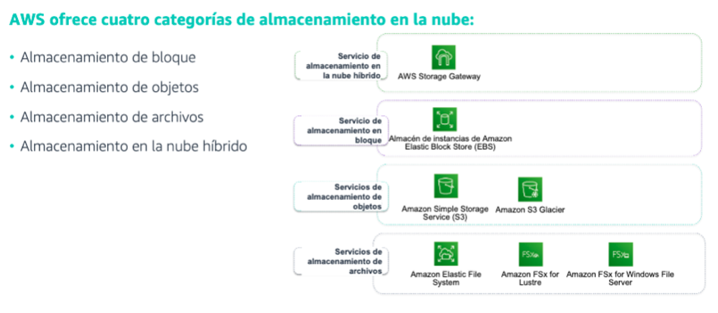
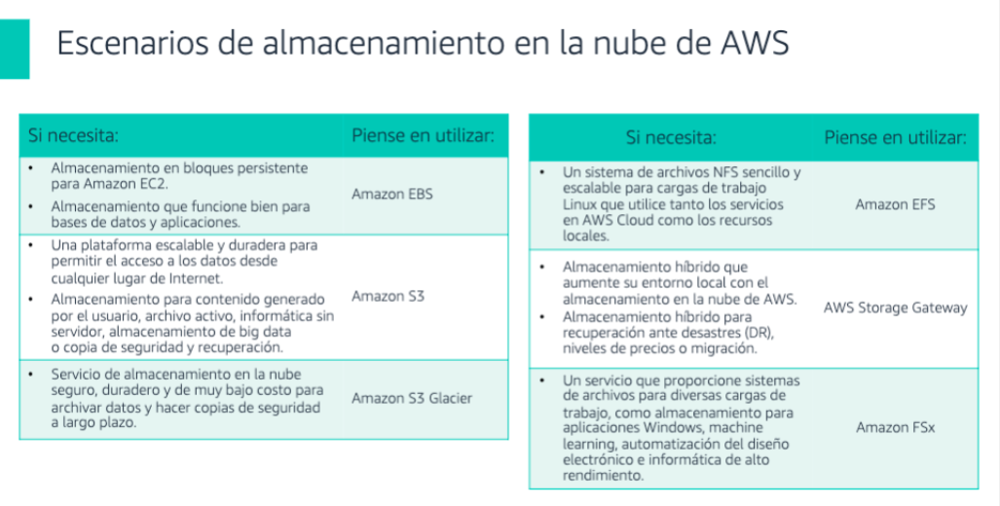

[Almacenamiento](../../2-Almacenamiento/)

# 1. Almacenamiento en la nube

## 1.1 ¿Que es?

El almacenamiento en la nube es un modelo de informática en la nube que almacena datos en Internet a través de un proveedor de informática en la nube, que administra y opera el almacenamiento de datos como servicio.

## Informacion suelta de algun test

Como  Funciona:           
    
    * El almacenamiento en la nube se compra a un proveedor de nube externo, que posee y opera la capacidad de almacenamiento de datos y la entrega a través de Internet en un modelo de pago por uso. Estos proveedores de almacenamiento en la nube administran la capacidad, la seguridad y la durabilidad para que sus aplicaciones puedan acceder a los datos de todo el mundo.

### Categorias de almacenamiento en la nube

### Escenarios

